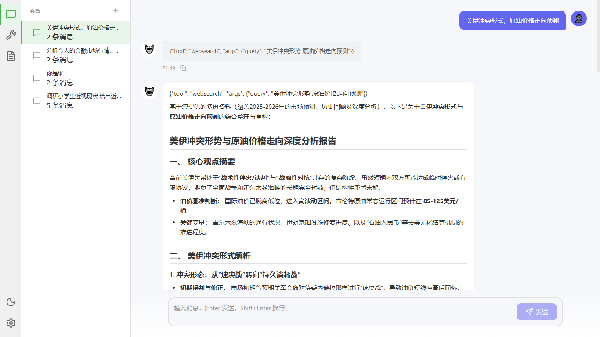
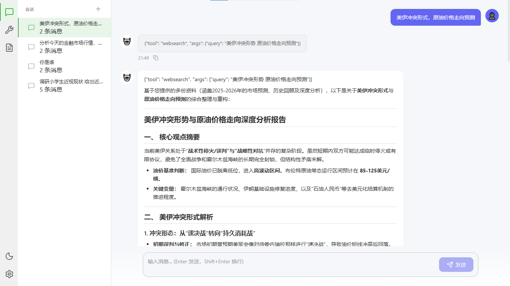
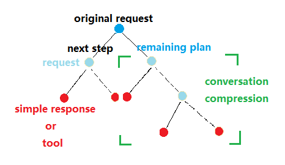

# Garlic

**Garlic** is a web-based general-purpose AI Agent framework that provides a visual interactive interface and a complete API. It supports parallel multi-session processing, tool execution, and context management, enabling AI Agents to work as efficiently as skilled craftsmen.

## Interface Preview




## Core Philosophy

### Conversation Backtracking & Compression

The conversation backtracking algorithm is the core of Garlic. Drawing inspiration from classic computer science algorithms, it enables agents to autonomously achieve goals through progressive approximation. Unlike multi-agent role-playing or collaborative approaches to complex tasks, this method avoids the high token overhead and unpredictable processes associated with free-form multi-agent dialogues.



### Knowledge, Skills, and Tools

- **Knowledge and experience** are increasingly being internalized into the models themselves. In today's environment where "when in doubt, just ask AI," AI has already demonstrated advantages over humans in the knowledge dimension.

- In Garlic, **Skills** are fundamentally also **Tools**—they are "composite tools" rather than independent skill concepts. Tools will **persist in the system** as interfaces for Agents to perceive and interact with the external world. **The tool system supports dynamic extension**.

```
┌─────────────────────────────────────────────────────────┐
│                      Agent                             │
│  ┌─────────────────┐         ┌─────────────────────┐   │
│  │    Knowledge    │         │       Tools         │   │
│  │ (Internalized)  │         │ (External Interfaces)│   │
│  │                 │         │                     │   │
│  │  · Programming  │         │  · File I/O         │   │
│  │  · Reasoning    │    ════►│  · Web Search       │   │
│  │  · Language     │         │  · Command Execution│   │
│  │  · Domain Expert│         │  · Composite Tools  │   │
│  │                 │         │    (Skills)         │   │
│  │  Grows w/ train │         │  Persists in system │   │
│  └─────────────────┘         └─────────────────────┘   │
│         ↑                          ↑                    │
│      Brain (Brain)             Limbs (Limbs)            │
└─────────────────────────────────────────────────────────┘
```

### Personalized Tools

> 🚧 Under construction, stay tuned

## Memory

> 🚧 The Memory module is currently under development and will provide long-term memory and context management capabilities

## Core Features

- **Web Visual Interface**: A modern React-based Web UI supporting multi-session management and real-time interaction
- **Intent Routing**: Automatically classifies requests as tool calls or simple Q&A
- **Tool Execution**: Supports built-in Go native tools and dynamically extensible Python scripts
- **Multi-LLM Support**: Configurable OpenAI and Alibaba Cloud Bailian models
- **Multi-Session Management**: Users can maintain multiple independent conversation sessions
- **Streaming Output**: Real-time streaming responses via WebSocket
- **RESTful API**: Complete HTTP API interfaces for easy integration

## Architecture Flow

```
User Request → Web UI / REST API / WebSocket
              ↓
         Session (Add to conversation)
              ↓
    Workflow Pipeline (Route → Execute)
              ↓
   (Tool | Simple Q&A | Step-by-Step)
              ↓
  Session (Update conversation & todos)
```

## Quick Start

### Requirements

- Go 1.26+
- Python 3.11+
- Node.js and npm (for frontend build)
- API keys for LLM providers

### Installation

```bash
# Clone the repository
git clone <repository-url>
cd garlic

# Install Go dependencies
go mod tidy
```

### Configuration

1. Copy `config.yaml.example` to `config.yaml`
2. Set API keys (supports `${ENV_VAR}` syntax)

```bash
export OPENAI_API_KEY=your-openai-api-key
export BAILIAN_API_KEY=your-bailian-api-key
```

## Makefile Commands

The project provides a Makefile to simplify common development and build tasks.

### Available Commands

| Command | Description |
|---------|-------------|
| `make setup` | Download and extract Chrome and ChromeDriver (for websearch tool) |
| `make build-frontend` | Build frontend project |
| `make build-backend` | Build backend project |
| `make build` | Build frontend and backend (default) |
| `make all` | Download dependencies and build everything |
| `make clean` | Clean build artifacts |
| `make run` | Build and run the project |
| `make help` | Show help information |

### Usage Examples

```bash
# First-time setup: download Chrome dependencies and build
make all

# Build project only
make build

# Run the project
make run

# Clean build artifacts
make clean

# View help
make help
```

## Project Structure

```
garlic/
├── cmd/
│   └── main.go                  # Entry point, main REPL loop
├── internal/
│   ├── agents/                  # Agent implementations (Router, Executor, Organizer, Summarizer)
│   ├── config/                  # YAML configuration loading
│   ├── harness/                 # Core orchestration (sessions and workflows)
│   ├── llm/                     # LLM client wrapper
│   └── tool/                    # Tool execution and discovery
├── tools/                       # Python tools directory
├── web/                         # Frontend project
├── config.yaml                  # Application configuration
└── Makefile                     # Build automation
```

## Session Commands

At runtime, you can use the following commands to manage sessions:

```
/new [name]     - Create a new session
/list           - List all sessions
/switch <id>    - Switch to specified session
/delete <id>    - Delete session
/current        - Show current session
```

## Architecture

Garlic uses a workflow pipeline to process user requests:

```
User Request → Session (Add to conversation)
              ↓
    Workflow Pipeline (Route → Execute)
              ↓
   (Tool | Plan | Simple)
              ↓
  Session (Update conversation & todos)
```

### Core Components

- **Router**: Intent classification (tool/simple/step_by_step)
- **ExecutorAgent**: Selects and executes tools
- **OrganizeAgent**: Organizes conversation content
- **SummarizerAgent**: Summarizes conversation results

## Development

### Adding Tools

Python tools should be placed in `tools/<tool-name>/main.py`, following this structure:

```python
#!/usr/bin/env python3
"""Tool description."""

import argparse
import json

def main():
    parser = argparse.ArgumentParser(description='Tool usage instructions')
    parser.add_argument('-param', type=str, required=True, help='Parameter description')
    args = parser.parse_args()

    # Tool logic...
    result = {"success": True, "data": {...}}
    print(json.dumps(result))

if __name__ == '__main__':
    main()
```

### Go Native Tools

Implement the `Tool` interface:

```go
type Tool interface {
    Name() string
    Description() string
    Execute(ctx context.Context, args map[string]interface{}) (*ToolResult, error)
}
```

## License

MIT

## Star History

[](https://star-history.com/#antibits/garlic&Date)